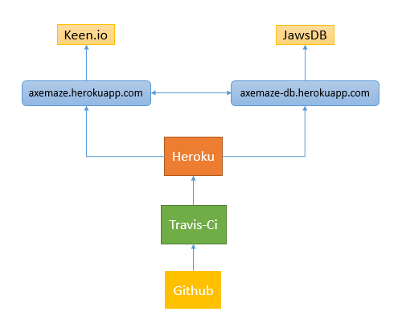

##Group 9 - Procedural Content
###Project Report

###Background
A large portion of game development time is spent on content development, from the time it takes to make the tools to create the content to create the content itself. In order to reduce the effort required to develop sufficient content to keep players happy, some developers have turned to Procedural content generation, in which content is produced via an algorithm. In his article [Nine Paths To Indie Game Greatness][indiegreatness], David Marsh recommends aspiring developers lean heavily on user-generated and proceudral content to keep development time down, citing another developer, Introversion Software, who cut their development time down from 3 years (Darwinia) to 1 year (DEFCON) by switching from hand-crafted content to publicly available and procedural content.
These algorithms are varied and can be quite complicated, taking up a significant portion of development time themselves. Not only this, but because the results of the algorithms are not always the same, the eventual product may not be exactly what the developer or player expect. Developers then either have to adjust their expectations accordingly or spend time fine-tuning the algorithms, usually some combination of both.
These difficulties are what our project hopes to take some measure of.

###Goals
Our goals with this project are twofold:
Firstly, to determine how difficult it is to produce the tools and content itself by hand and compare this to how difficult it is to produce procedural generation algorithms to produce content of acceptable quality.
Secondly, to make it easily possible to give both sets of content to users and determine what, if any, difference in game enjoyment these two methods result in via survey.
In order to accomplish these goals, we decided to use a simple maze game. We decided on this format because making a game engine to play mazes would be easier than a more complicated game. Not to mention, there is already a [mountain of work][mazealgs] on generating and solving mazes out there, which would make the procedural portion of the development process much quicker.
We can easily quantify how many man hours we spent on producing the tools and content for hand written content, as well as the time spent on creating procedural generation algorithms, since we have GitHub's issues and commit tracking systems. Quantifying how much users enjoy handwritten or procedural content is much more difficult to do, and so instead of attempt to do it ourselves, we've left it for another group of people to attempt using our game. A proof-of-concept system is enough, the later group can go in and expand upon our work if it is necessary to do so.

###Infrastructure

####Continuous Integration

When defining Continuous Integration it is unnecessary to look further than Martin Fowler's article [Continuous Integration][contint].  Fowler defines it as: "a software development practice where members of a team integrate their work frequently, usually each person integrates at least daily - leading to multiple integrations per day. Each integration is verified by an automated build (including test) to detect integration errors as quickly as possible. Many teams find that this approach leads to significantly reduced integration problems and allows a team to develop cohesive software more rapidly."  Our team chose to use continuous integration as a means of running static analysis and unit testing.  The structure of our process is as shown in the following image:

The first stop for most of our code is, as with many projects, [GitHub](http://wwww.github.com "GitHub").  This paper's home is planned to be on github, so whoever is reading it should be likely to know about git and github, but for the truly uninitiated git is a system for version control, and github is used for hosting git projects.  

####Travis-CI

Our continuous integration process is orchestrated using a tool called [travis-ci](https://travis-ci.org "Travis CI").  Travis-ci is actually a company that offers cloud based build server functionality for free.  The build server what takes care of the automated build part of Fowler's definition of continuous integration.  There are a number of advantages in going with a hosted build server:

- It's free: This is obviously one of the biggest advantages, but may not be the case in the future.
- Setting up a build server yourself can be time consuming.
- Running a build server for a team can require either using IAAS (infrastructure as a service) based servers from a provider such as [Amazon Web Services](http://aws.amazon.com/ "Amazon Web Services"), or having your own hardware infrastructure.  Both of which can be quite costly.
- Travis-CI is very simple to configure, all configuration takes place in a file called `.travis.yml`.  It uses the [.yml](http://yaml.org/ "YAML Ain't Markup Language") file format which is very quick to pick up for any seasoned developer.

Our project used travis-ci to conduct a number of different tasks that needed to be completed to determine whether the project was successfully building or failing.  The tasks are as follows:  First and most importantly we used travis-ci to run our unit tests.  Travis-ci's build boxes are in effect normal Linux virtual machines running on cloud infrastructure that have a very particular boot and run proceedure.  Whenever a push is made to our git repository, travis-ci receives a build request.  Their system boots up a virtual machine according to the specifications indicated in the .travis.yml file and actually pulls the contents of the repository into a directory on the build box.  The build box then installs any needed modules per our package.json file and runs our test proceedure.  

The testing and static analysis is as follows: 

- Run unit tests using [Mocha](http://mochajs.org/ "Mocha") as detailed elsewhere in the paper
- Run unit test coverage analysis using [istanbul](https://github.com/gotwarlost/istanbul "gotwarlost/istanbul")
- Run static analysis using [jshint](http://jshint.com/ "JSHint")
- Finally run Heroku deployment, as will be discussed later

####Continuous Delivery/Continuous Deployment

Deployment is an important feature with our particular project.  Initially we received feedback that it would be a major fault in our design if the game itself needed to be installed locally to be played.  Taking that feedback to heart we looked for a good way to deploy our game to the web in a way that it would be easy to visit for any particular user.  Given that prior to this feedback we already were using travis-ci it seemed most logical to look for a deployment option that would sync well with our continuous integration system.  

This is where the idea of Continuous Deployment comes in to play.  Per [Fitzgerald and Stol][fitzstol] "Continuous deployment is the practice of continuously deploying good software builds automatically to some environment, but not necessarily to actual users." While continuous delivery is an extension of that process to deployment to actual customers.  Initially our process would have been defined as continuous deployment, but if we ever have "customers" we would be in a position of continuous delivery.

####Heroku

Essentially the last step in our continuous integration process as described above is deployment to [Heroku](http://wwww.heroku.com "Heroku").  Heroku is a full featured deployment system for web applications.  It functions in somewhat the same fashion as travis-ci in that it runs on cloud infrastructure in a PAAS (Platform as a service) configuration.  The "dyno" is for Heroku what would be a node on many other services.  It is essentially a virtualized server running on some sort of cloud infrastructure.  Again for Heroku it would be possible to use an IAAS cloud service to create the same sort of setup, but Heroku has a large number of features going for it as follows:

- Heroku is free for five "dynos" (a provisioned virtual machine instance running your application)
- There's no real setup aside from knowing that Heroku exists and setting up package.json, and .travis.yml to link to your account.
- Heroku creates fairly short URL's that are publicly accessible and assigned according to your specifications (as long as a particular name is available), additionally Heroku offers the ability to use commercially available domain names should you own a domain name you'd like to use.
- Heroku has a number of addons that increase the functionality that is available, our project utilized an addon that will be discussed in the database section of this paper.
- Scalability is another strong factor in favor of Heroku since it is simple to add in more "dynos" if necessary to deal with load issues

Our project is using two dynos currently.  One dyno is being used for actually running the game ([Axemaze](http://axemaze.herokuapp.com/ "Axemaze")), the other dyno is being used for our database and REST API ([Axemaze-DB](http://axemaze-db.herokuapp.com)).  The benefit of using Heroku for both was that we could build our database functionality in another branch of the same github repository and upon pushes to either branch travis-ci runs then Heroku deploys to the correct dyno.

####Database

Discussion of deployment and Heroku leads naturally in to the database setup that we created for this project.  [JawsDB](http://www.jawsdb.com/ "JawsDB") is a cloud based MySQL database that is being offered as an addon to Heroku currently.  The beneficial thing with an addon is that it does not count against your 5 dyno limit with Heroku, but it really operates on a cloud instance that is likely the same size as a dyno.  JawsDB is a SAAS (software as a service) cloud service which uses an IAAS provider to create cloud MYySQL databases.

The obvious question at this point is why bother with a database at all of this type of software.  Initially we were using JSON objects for the mazes and storing those in a directory local to the running instance of the game.  For the near term this would be a fine choice, but in thinking to the future of the application and any future use that may contribute to the number of mazes it would quickly be necessary to use a more structured method of data storage that is not tied as closely to the actual repository for the game itself.  JawsDB presented itself as a way to deal with many of those issues in a very streamlined fashion nightly backups and scalability should the database need to grow beyond the free tier that JawsDB offers.

The team initially had very little experience using databases in a web app environment and went through a number of dead ends before coming to JawsDB and quickly realizing that the instance of the database should not be accessible directly by the game.  There are a number of stack overflow posts that deal with this very issue, but the most straightforward is [here](http://stackoverflow.com/questions/659970/why-is-it-not-advisable-to-have-the-database-and-web-server-on-the-same-machine "Why is it not advisable to have the database and web server on the same machine?")  As the post makes clear there are a number of reasons to separate these two facets of a system, but security and performance are the strongest reasons to do so.

This separation necessitated the creation of a RESTful API for communication with the database.  [Pautasso][restbook] states that, REST "in case of the HTTP protocol, a set of methods (e.g., GET, PUT, DELETE, POST, HEAD, OPTIONS, etc.) with well defined semantics in terms of the effect on the state of the resource, are defined. HTTP methods can be applied to all Web resource identifiers (e.g., URIs which conform to the HTTP scheme)."  This is the way our team used our RESTful API to communicate between the MySQL database and the application.  The API is hosted on the same dyno as the database and all communication with the outside world is handled through the API.  A diagram is shown below to describe the relationship of the app, server, database, and API.

####Analytics

This brings us around to the final piece of our infrastructure: Analytics.  To prove or disprove the hypotheses set forth in this paper we needed data.  Extracting users likes or dislikes can be challenging, but we chose a very simple mechanism to get, store, and analyze this data.  When users visit the site they are presented with a randomly chosen maze, that can be either procedurally generated or hand-written.  Upon finishing a maze the user is asked for a binary opinion on the maze.  

We have utilized a service called [Keen IO](https://keen.io/ "Keen IO") to capture this information.  It stores a large amount of information on clicks for either like or dislike including the time of the click, IP information, and simple geolocation data.  We store also whether the maze was procedural or not and whether they liked the maze.  Then that information is stored on keen.io's servers in a relational database that is easy to query and generate visualizations from.  We have created a simple visualization that uses this click data and that can be seen [here](http://axemaze.herokuapp.com/pie.html "Pie Chart").  Obviously the game has not been played by real users out in the wild and the only opinions that are currently represented in the graphs are our own opinions.  Luckily the system allows us to quickly dump all stored data if we should end up having real users and can begin to store their information.

####Upsides and Downsides of Infrastructure

This final section on our infrastructure attempts to answer whether all of this is worth it or not and what we are really getting for all of this effort.  It seems clear from the above material that there are many strong benefits to the way our process came together, but the most important benefits are the ways that this infrastructure allowed us to work together efficiently.  Those benefits are as follows:

- Notifications on broken builds
- Prevention of faulty builds being deployed
- Quick feedback on work's success or failure
- Simple automatic deployment
- It is all free so no one person had to pay for it

The downsides are also easy to spell out:  First and most detrimental is the fact that all of these services represent a risk to whether the application can be deployed or built.  If one service was to go down our work flow and our game may not work at all, or may only work partially.  This risk is present for many companies that run their businesses on the web today.  A large number of massive companies, as seen in Amazon's case studies page [here](http://aws.amazon.com/solutions/case-studies/ "Customer Success. Powered by the AWS Cloud.") use AWS (Amazon Web Services), services that are very similar to the services we have leveraged, so it does represent a sort of risk for the industry as a whole.  That said, our project makes use of multiple services that are backed by potentially a higher multiple of services which makes our risk level much higher than it would be using only one provider.  

Another potential downside here is the possibility that all of these services in the future could become pay to play.  Right now all of this is free, but it seems hard to believe that that will be the case in perpetuity.  We have already dealt with this downside in the fact that during the time we worked on this project JawsDB went from a free beta offering to a monthly subscription fee.  Luckily the fee will only begin to be charged at the beginning of May.  This is an area where we could easily create the same service in Heroku or elsewhere, but should a service like travis-ci or Heroku become a paid service it would be difficult to replace.

Finally the amount of time required to research, set up, and put into place all of these services is non-trivial.  One member of the team spent a large portion of his time doing the work required to set all of the services involved up.  That represents a trade-off for the team overall:  Would the project have been better off with the work of this extra team member on the project itself, or do the benefits to productivity for the team as a whole outstrip any additional effort that would have been leveraged on the project? That call is best left to the reader, rather than be made by an over-presumptuous writer.

###Discussion
####Difficult in testing GUI
A lot of our project's functionality depends on the GUI working properly, which is difficult to test. We ended up making up a series of informal functional tests that one of the development team would have to work through manually if they felt like testing, but more often our testing process was even less formal than that. While working on a feature, each developer tended to only test new features added to the GUI, expecting old features to continue to work. This bit us a few times, with some new feature breaking old functionality. A tool to automate interacting with the GUI would be useful, but we found nothing easy enough to setup to justify the effort of setting it up.
####Prevalence of free resources
Much of our project relies on freely available cloud resources, namely Heroku, TravisCI, and GitHub. While working on this project we marveled at how easy it is to setup and deploy code in an automated fashion, all for free. We believe it's safe to say that software engineering has never been this easy to do right, and for free, with a minimum of in-house expense for small projects.

###Conclusion
Both procedural and hand crafted content provide their own challenges of implementation. Some of our favorite games include both, and from our small experience in creating both, we feel it's safe to say that a mix of both is the best path for an aspiring developer.
Without being able to say for certain that people tend to prefer one or the other, we can say with certainty that hand crafted content is time consuming, but procedural content can become in turns "samey" or unpredictable, depending on how much time was spent on tuning the generator. Reigning in a procedural generation engine to exact specifications is, however, very time consuming, almost on the same level as producing enough content by hand, so excessive tuning is also not the answer. Thus, a balance of both is the best use of a devloper's time, using procedural engines for portions of the game that don't need to be very carefully tuned and handcrafted content for portions that need to be exacting.

###Future Work
We did not have the time or resources to deploy our application to the world at large to record useful statistics, therefore we recommend another group inherit our code and attempt to do so. We utilized several services that may or may not continue to give out time for free if used on a large scale, so another service, or self hosting, may be required, which would necessitate changing our codebase slightly.
In addition, we did not have enough time to create enough hand-crafted content to reduce the chance of a user seeing the same maze twice, therefore we also recommend that whoever resumes work on this project also make more mazes.

###References
[Nine Paths to Indie Game Greatness - David Marsh][indiegreatness]

[Think Labyrinth: Maze Algorithms - Walter D. Pullen][mazealgs]

[Continuous Integration - Martin Fowler][contint]

[Continuous Software Engineering and Beyond: Trends and Challenges - Brian Fitzgerald & Klaas-Jan Stol][fitzstol]

[REST: Advanced Research Topics and Practical Applications - Cesare Pautasso, Erik Wilde, Rosa Alarcon][restbook]

[indiegreatness]: http://www.gamasutra.com/view/feature/131952/nine_paths_to_indie_game_greatness.php?print=1 "Nine Paths to Indie Game Greatness - David Marsh"
[mazealgs]: http://www.astrolog.org/labyrnth/algrithm.htm#create "Think Labyrinth: Maze Algorithms - Walter D. Pullen"
[contint]: http://www.martinfowler.com/articles/continuousIntegration.html "Continuous Integration - Martin Fowler"
[fitzstol]: http://staff.lero.ie/stol/files/2014/03/rcose2014_fitzgerald.pdf "Continuous Software Engineering and Beyond: Trends and Challenges - Brian Fitzgerald & Klaas-Jan Stol"
[restbook]: http://www.springer.com/us/book/9781461492986 "REST: Advanced Research Topics and Practical Applications - Cesare Pautasso, Erik Wilde, Rosa Alarcon"

